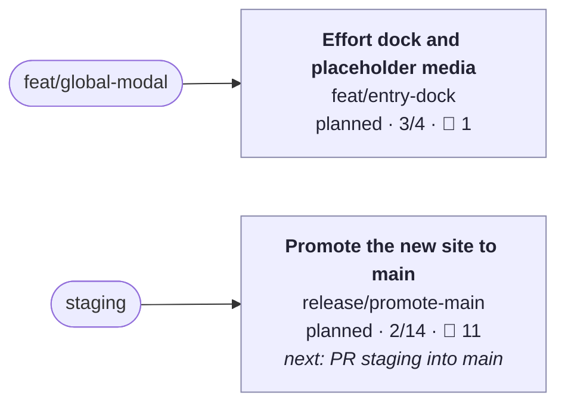

# Work board

_Updated 2026-10-04 19:36 UTC on `` by `bw board`. Generated; edit seeds with `bw`._

🟩 active · 🟨 in review · 🟦 planned · 🟥 blocked · blue outline: checked out · 🙋 questions waiting on you

## 🙋 Needs you

**Questions**

- [ ] Feel check of the new open in lite and 3D (from anim/modal-open) · `release/promote-main`
- [ ] Review the Arbor and project blurbs (written from existing descriptions) (from content/real-copy) · `release/promote-main`
- [ ] Decide where /links appears (home menu, nav bar, or as home like the old branch) (from content/real-copy) · `release/promote-main`
- [ ] The resume PDF is the 2024 copy from the old site and predates Arbor (from content/real-copy) · `release/promote-main`
- [ ] Design review in 3D and lite mode (from design/retro-chrome) · `release/promote-main`
- [ ] Pick one background-primary: static CSS uses #043030, the knobs' runtime default is #003838 (read from a commented SCSS line) (from design/retro-chrome) · `release/promote-main`
- [ ] Design review on a phone (from feat/mobile-carousel) · `release/promote-main`
- [ ] Design review of the list and modal in 3D and lite mode (from feat/modal-panels) · `release/promote-main`
- [ ] Curate real panel content (screenshots, galleries, stats) per project (from feat/modal-panels) · `release/promote-main`
- [ ] Allow lossy WebP for the colour bake (q85 saves about 0.8 MB more) after a visual check (from perf/assets) · `release/promote-main`
- [ ] Approve the share image and description, and confirm the canonical domain is henryjones.xyz (from seo/meta) · `release/promote-main`

**Media to find**

- [ ] Replace each 'Image to come' placeholder (5 experience entries, 3 efforts); the label says what belongs there · `feat/entry-dock`

## 🟢 Happening now

- Nothing active.

## 🕘 Just happened

- 27m ago · feat(entries): an effort dock and labelled placeholder media · `feat/entry-dock`
- 4h ago · feat(modal): the desktop modal opens like the phone carousel; links zoom out of their word · `feat/entry-dock`
- 6h ago · docs: roadmap reflects efforts, sharing and entry links · `feat/entry-dock`
- 6h ago · feat(modal): any link can open an entry, zooming out of where it was clicked · `feat/entry-dock`

**Merged, not yet landed** (run `bw land <branch> --into <next branch>`)

- `feat/global-modal` into `staging`: Inline links that open any modal
- `feat/shareable-urls` into `staging`: Shareable state and per-link previews

**Landed and folded**

- 2026-10-04 **feat/efforts** → `staging`: Highlighted efforts inside experience entries. Effort data model and a mini nav inside the open entry; Efforts: Almanac skill manager (Arbor), Kiki UI design system (ChannelAI), User notifier (Arbor); Hero numbers kit: big numbers plus simple theme charts for efforts without flashy visuals; Deep links from prose open the entry modal on one effort; Mark unverified data claims in the data and show it only in debug
- 2026-10-04 **feat/links-retro** → `staging`: Links page in the retro style. Restyle /links as raised retro keys, in theme with the old links page; Link to /links from About, with the old site's link icon; Axe and e2e stay green
- 2026-10-04 **feat/mobile-carousels** → `staging`: Experience and projects carousels on phones. One carousel component for experience and projects on phones; First tile centred on both axes; scroll area full width; no side dead space; Borrow the paint-in from the list entries: border draws, typewriter titles, staggered children; Keep the tile-to-page morph exactly as it is now; e2e for the experience carousel and centring
- 2026-10-04 **anim/restore-timing** → `staging`: Restore from expanded on the window's clock. Measure restore frame by frame and confirm the reflow runs ahead of the container; Copy the carousel's approach (one element owns the size change, content follows) to restore; e2e: restore keeps content inside the window and settles with it
- 2026-10-04 **fix/mobile-polish** → `staging`: Phone polish and an updated map. iOS Safari shows the page colour behind and around the page, not white (html background, theme-color); Mobile site header about 15% larger; Map: no longer on the job market; working at Arbor (remote), based in New York City; Prune the plans whose branches have all landed

<b>Plans</b>

- `2026-10-mobile-efforts.md`: 7/7 branches done (complete; the next `bw land` removes it)
- `2026-10-roadmap.md`: 3/4 branches done

<b>All branches</b>

| Branch | Status | Done | Commits | Remote | Next | PR |
|---|---|---|---|---|---|---|
| `feat/entry-dock` | planned | 3/4 | 4 | pushed | — |  |
| `release/promote-main` | planned | 2/14 | 0 | pushed | PR staging into main |  |

<b>feat/entry-dock</b>: Effort dock and placeholder media (3/4)

Open entries switch efforts from a compact retro dock with a sliding indicator instead of big buttons, and every listing shows labelled placeholder media where a specific image belongs, so the owner can see what to supply.

- [x] Dock replaces the effort tab buttons (modal, expanded, phone open view)
- [x] Placeholder media component, labelled with what image belongs there
- [x] Placeholders on experience entries and efforts
- [ ] 🙋 media: Replace each 'Image to come' placeholder (5 experience entries, 3 efforts); the label says what belongs there

Commits:

- `e36a4f0c` feat(entries): an effort dock and labelled placeholder media
- `a0dee110` feat(modal): the desktop modal opens like the phone carousel; links zoom out of their word
- `5c351640` docs: roadmap reflects efforts, sharing and entry links
- `026e795a` feat(modal): any link can open an entry, zooming out of where it was clicked

<b>release/promote-main</b>: Promote the new site to main (2/14)

Retire the old webpack site once staging carries everything above.

- [x] Confirm Netlify deploy settings for main and staging
- [ ] PR staging into main
- [ ] 🙋 Feel check of the new open in lite and 3D (from anim/modal-open)
- [ ] 🙋 Review the Arbor and project blurbs (written from existing descriptions) (from content/real-copy)
- [ ] 🙋 Decide where /links appears (home menu, nav bar, or as home like the old branch) (from content/real-copy)
- [ ] 🙋 The resume PDF is the 2024 copy from the old site and predates Arbor (from content/real-copy)
- [ ] 🙋 Design review in 3D and lite mode (from design/retro-chrome)
- [ ] 🙋 Pick one background-primary: static CSS uses #043030, the knobs' runtime default is #003838 (read from a commented SCSS line) (from design/retro-chrome)
- [ ] 🙋 Design review on a phone (from feat/mobile-carousel)
- [ ] 🙋 Design review of the list and modal in 3D and lite mode (from feat/modal-panels)
- [ ] 🙋 Curate real panel content (screenshots, galleries, stats) per project (from feat/modal-panels)
- [x] Confirm the first CI run is green on every stacked PR (from modalize-leva-work)
- [ ] 🙋 Allow lossy WebP for the colour bake (q85 saves about 0.8 MB more) after a visual check (from perf/assets)
- [ ] 🙋 Approve the share image and description, and confirm the canonical domain is henryjones.xyz (from seo/meta)

