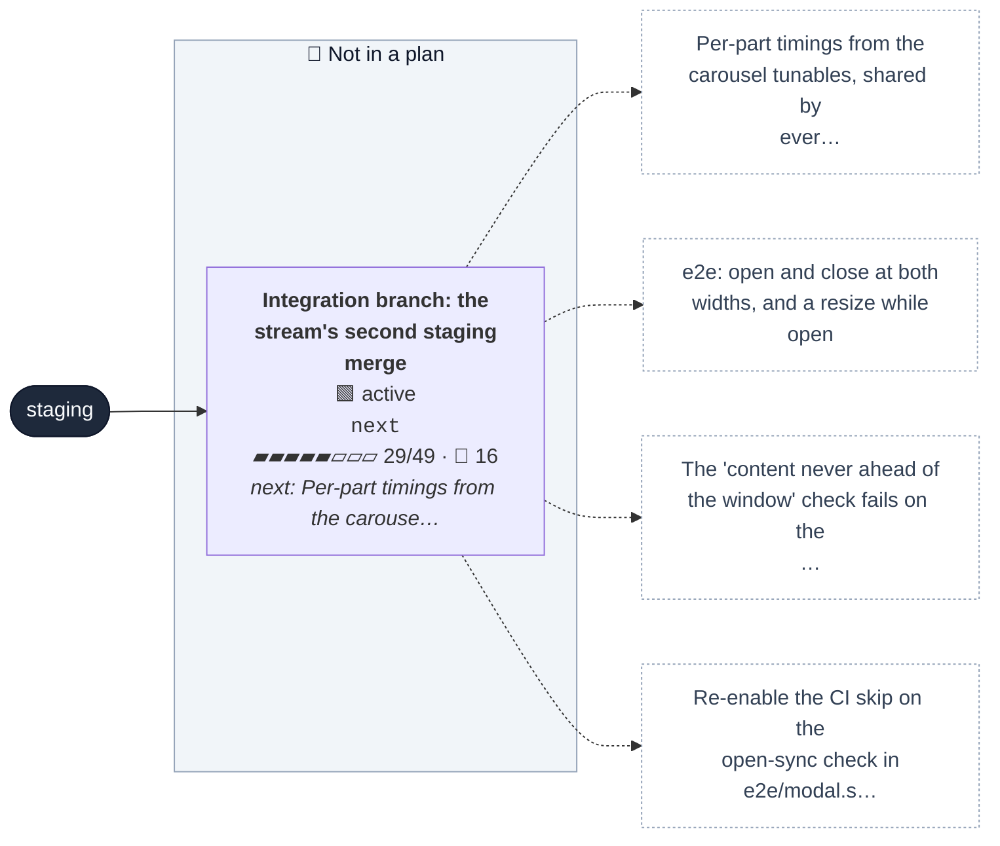

# Work board

<b>About this board</b> · updated 2026-10-05 14:28 UTC · 1 live branches · 0 PRs open · 16 waiting on you

| | |
|---|---|
| Generated | 2026-10-05 14:28 UTC by `bw board` on `next` |
| Trunk | `staging` |
| Live branches | 1 |
| Open PRs | none |
| Waiting on you | 16 |
| Source of truth | each branch's seed in `.work/branches/`; this file is regenerated, never edited |

<b>The wider world</b> · 1 live branches, 15 recent landings

<b>Legend</b>

```mermaid
flowchart LR
  n_staging([staging])
  class n_staging trunk
  subgraph loose["🧩 Not in a plan"]
    n_next["<b>Integration branch: the<br/>stream's second staging<br/>merge</b><br/>🟩 active<br/><code>next</code><br/>▰▰▰▰▰▱▱▱ 29/49 · 🙋 16<br/><i>next: Per-part timings from the carouse…</i>"]
    class n_next active,current
  end
  style loose fill:#f1f5f9,stroke:#94a3b8,color:#0f172a
  n_staging --> n_next
  landed_0["✅ Experience and projects<br/>carousels on phones<br/><code>feat/mobile-carousels</code> · 2026-10-04"]
  class landed_0 merged
  n_staging --- landed_0
  landed_1["✅ Links page in the retro<br/>style<br/><code>feat/links-retro</code> · 2026-10-04"]
  class landed_1 merged
  n_staging --- landed_1
  landed_2["✅ Highlighted efforts inside<br/>experience entri…<br/><code>feat/efforts</code> · 2026-10-04"]
  class landed_2 merged
  n_staging --- landed_2
  landed_3["✅ One window for every open<br/>entry<br/><code>entry/window</code> · 2026-10-05"]
  class landed_3 merged
  n_staging --- landed_3
  landed_4["✅ One list that is a carousel<br/>on phones<br/><code>entry/list</code> · 2026-10-05"]
  class landed_4 merged
  n_staging --- landed_4
  landed_5["✅ A control panel for colour,<br/>type and effects<br/><code>feat/control-panel</code> · 2026-10-05"]
  class landed_5 merged
  n_staging --- landed_5
  landed_6["✅ Mock media and a list of<br/>content to source<br/><code>feat/content-requests</code> · 2026-10-05"]
  class landed_6 merged
  n_staging --- landed_6
  landed_7["✅ One inbox for the owner's<br/>answers<br/><code>bw/inbox</code> · 2026-10-05"]
  class landed_7 merged
  n_staging --- landed_7
  landed_8["✅ The control panel on phones<br/><code>feat/panel-phones</code> · 2026-10-05"]
  class landed_8 merged
  n_next --- landed_8
  landed_9["✅ One open morph, the<br/>carousel's, at every wi…<br/><code>entry/open</code> · 2026-10-05"]
  class landed_9 merged
  n_next --- landed_9
  landed_10["✅ A 2D knob and mini sliders<br/>for the control …<br/><code>feat/panel-knob</code> · 2026-10-05"]
  class landed_10 merged
  n_next --- landed_10
  landed_11["✅ The 3D knobs drive the<br/>control panel's page<br/><code>feat/knob-mapping</code> · 2026-10-05"]
  class landed_11 merged
  n_next --- landed_11
  landed_12["✅ Tidy after the entry merge<br/><code>entry/cleanup</code> · 2026-10-05"]
  class landed_12 merged
  n_next --- landed_12
  landed_13["✅ Drafted prose in the request<br/>list<br/><code>content/prose-requests</code> · 2026-10-05"]
  class landed_13 merged
  n_next --- landed_13
  landed_14["✅ DRY and code-splitting pass<br/>after the stream<br/><code>chore/dry-pass</code> · 2026-10-05"]
  class landed_14 merged
  n_next --- landed_14
  classDef merged fill:#dcfce7,stroke:#16a34a,color:#052e16
  classDef todo fill:#ffffff,stroke:#94a3b8,stroke-dasharray:2 2,color:#334155
  classDef planned fill:#c7d2fe,stroke:#4f46e5,color:#1e1b4b
  classDef sketched fill:#f8fafc,stroke:#64748b,stroke-dasharray:4 3,color:#334155
  classDef active fill:#bbf7d0,stroke:#16a34a,stroke-width:3px,color:#052e16
  classDef review fill:#fde68a,stroke:#d97706,stroke-width:3px,color:#451a03
  classDef blocked fill:#fecaca,stroke:#dc2626,stroke-width:3px,color:#450a0a
  classDef trunk fill:#1e293b,stroke:#0f172a,color:#f8fafc
  classDef current stroke:#0ea5e9,stroke-width:5px
```

- 🟩 active: being worked on now
- 🟨 review: a PR is open and waiting on CI, review or a merge
- 🟦 planned: sketched as a branch with a seed, not started
- 🟥 blocked: waiting on something outside the branch
- Dashed: named in a plan, no branch yet; ✅ a recent landing (both only under The wider world)
- The top graph is the dashboard: every planned and active branch, with the next todos on active ones
- Blue outline: the branch checked out in the working copy
- `3/4`: todos done out of total · 🙋 n: questions on that branch waiting on you
- Arrows point from a branch to the branches built on top of it

## 🟢 Happening now

**What.** Every work-in-progress branch merges here instead of staging, so this stream reaches staging in two merges (the first was #88) and spends fewer build minutes. No Netlify deploy. Merges to staging once the stream is done.

**How, next.**

- Per-part timings from the carousel tunables, shared by every width (from entry/open)
- e2e: open and close at both widths, and a resize while open (from entry/open)
- The 'content never ahead of the window' check fails on the CI runner only (6 to 10px overhang) since #84; passes locally even CPU-throttled. Re-check once the morph is rebuilt (from entry/open)

| Branch | PR | Status | Progress | Next | Plan |
|---|---|---|---|---|---|
| `next` |  | active, 12 to push | 29/49 | Per-part timings from the carousel tunables, shared by every width (from entry/open) |  |

## 🕘 Just happened

**refactor(styles): one media-fill mixin for the list and the window** · 2026-10-05 14:28 · `next` · `f55c8db2`
Co-Authored-By: Claude Opus 5.5 <noreply@anthropic.com>

- **chore(scripts): drop capture-modal-frames, which the motion-sheet skill supersedes** · 14:25 · `next` · `a2157a9a`
- **test(panel): skip the full screen round trip on CI, which cannot load the 3D scene** · 02:09 · [#88](https://github.com/henryjonescodes/portfolio/pull/88) · `945a067b`
- **fix(panel): the floating panel's tab line draws, and Escape only closes it from inside** · 01:25 · [#88](https://github.com/henryjonescodes/portfolio/pull/88) · `6a20899f`

<b>Earlier</b> (full notes for every landed branch are in the <a href="https://github.com/henryjonescodes/portfolio/blob/staging/.work/CHANGELOG.md">changelog</a>)

| When | What | Where |
|---|---|---|
| 2026-10-05 01:23 | feat(requests): request ids on placeholders, resolved by file name, and a generated REQUESTS list | [#88](https://github.com/henryjonescodes/portfolio/pull/88) · `3b71cf90` |
| 2026-10-05 01:04 | fix(entries): tile bar line draws, 3D list stays stacked, phone window header line shows | [#88](https://github.com/henryjonescodes/portfolio/pull/88) · `2b953f12` |
| 2026-10-05 00:24 | fix(entries): tile media shows and fills the tile on phones | [#88](https://github.com/henryjonescodes/portfolio/pull/88) · `f6a2d263` |
| 2026-10-05 00:20 | fix(panel): real tabs, a keyboard font row, and a modal floating window | [#88](https://github.com/henryjonescodes/portfolio/pull/88) · `6385b4c8` |
| 2026-10-05 00:20 | fix(prefs): ignore out-of-range stored values and apply before paint | [#88](https://github.com/henryjonescodes/portfolio/pull/88) · `f6b075a5` |
| 2026-10-05 00:15 | test: tiles use the list markup; crossing the breakpoint keeps the elements | [#88](https://github.com/henryjonescodes/portfolio/pull/88) · `9cd6eff6` |
| 2026-10-05 00:15 | feat(entries): one CSS-switched list for rows and tiles | [#88](https://github.com/henryjonescodes/portfolio/pull/88) · `c00d0c46` |
| 2026-10-05 00:15 | feat(border): redraw a border or line quickly on demand | [#88](https://github.com/henryjonescodes/portfolio/pull/88) · `b6f49807` |
| 2026-10-05 00:15 | test: make the e2e port configurable | [#88](https://github.com/henryjonescodes/portfolio/pull/88) · `2425db0f` |
| 2026-10-05 00:11 | feat(panel): colour, type and FX control panel in 3D and 2D | [#88](https://github.com/henryjonescodes/portfolio/pull/88) · `3d6f0049` |
| 2026-10-05 00:08 | feat(prefs): type, motion speed and CRT preferences with persistence | [#88](https://github.com/henryjonescodes/portfolio/pull/88) · `8e9b356a` |
| 2026-10-05 00:07 | test: let the e2e port come from E2E_PORT | [#88](https://github.com/henryjonescodes/portfolio/pull/88) · `b2165509` |
| 2026-10-05 00:06 | fix(entries): a phone-sized window drops any drag offset | [#86](https://github.com/henryjonescodes/portfolio/pull/86) · `7de48b4c` |
| 2026-10-05 00:02 | test: skip the open-sync check on CI only until the morph is rebuilt | [#86](https://github.com/henryjonescodes/portfolio/pull/86) · `0d2e49d1` |

## 🙋 Questions for you

### Facts to confirm

**1. User notifier sends about 250,000 notifications a month**
- *Why:* The User notifier effort leads with this figure, shown as unverified on the live site until you confirm it.
- `claim` · `next` · from `feat/efforts` · [experience.ts](https://github.com/henryjonescodes/portfolio/blob/staging/src/data/experience.ts)

**2. User notifier delivers at a 99.99% success rate**
- *Why:* The second headline figure on the User notifier effort, also marked unverified until confirmed.
- `claim` · `next` · from `feat/efforts` · [experience.ts](https://github.com/henryjonescodes/portfolio/blob/staging/src/data/experience.ts)

### Writing

**3. Almanac summary: a skill manager for the team's AI coding agents, one catalogue of shared skills kept in step across every repo**
- *Why:* Drafted from the existing entry text; you want most prose human-written and lightly edited.
- `prose` · `next` · from `feat/efforts` · [experience.ts](https://github.com/henryjonescodes/portfolio/blob/staging/src/data/experience.ts)

**4. Kiki UI summary: the design system behind ChannelAI's iOS app (components, color, typography)**
- *Why:* Drafted from the existing entry text; you want most prose human-written and lightly edited.
- `prose` · `next` · from `feat/efforts` · [experience.ts](https://github.com/henryjonescodes/portfolio/blob/staging/src/data/experience.ts)

**5. User notifier summary: a real-time email notification system that shows Arbor users what they are saving**
- *Why:* Drafted from the existing entry text; you want most prose human-written and lightly edited.
- `prose` · `next` · from `feat/efforts` · [experience.ts](https://github.com/henryjonescodes/portfolio/blob/staging/src/data/experience.ts)

**6. Review the Arbor and project blurbs (written from existing descriptions)**
- *Why:* They were rewritten from older descriptions and are the first thing visitors read in each entry.
- `prose` · `next` · [experience.ts](https://github.com/henryjonescodes/portfolio/blob/staging/src/data/experience.ts)

### Decisions

**7. Approve per-entry preview images, or generate them**
- *Why:* Shared links show a per-page title and description, but one site-wide image for every entry.
- `decision` · `next` · from `feat/shareable-urls` · [og-image.png](https://github.com/henryjonescodes/portfolio/blob/staging/public/og-image.png)

**8. Which page titles should link to entries? Map lines and prose mentions do now; headings are plain**
- *Why:* Map lines and prose mentions open entries anywhere on the site; headings are still plain text.
- `decision` · `next` · from `feat/global-modal` · [index.tsx](https://github.com/henryjonescodes/portfolio/blob/staging/src/components/EntryLink/index.tsx)

**9. Decide where /links appears (home menu, nav bar, or as home like the old branch)**
- *Why:* The page exists and About links to it, but nothing else on the site leads there.
- `decision` · `next` · [index.tsx](https://github.com/henryjonescodes/portfolio/blob/staging/src/pages/links/index.tsx)

**10. Pick one background-primary: static CSS uses #043030, the knobs' runtime default is #003838 (read from a commented SCSS line)**
- *Why:* The colour shifts slightly when a knob first moves, because static CSS and the knobs start from different shades.
- `decision` · `next` · [_colors.scss](https://github.com/henryjonescodes/portfolio/blob/staging/src/styles/_colors.scss#L12)

**11. Allow lossy WebP for the colour bake (q85 saves about 0.8 MB more) after a visual check**
- *Why:* The 3D colour texture could be about 0.8 MB smaller, but only if it still looks right to you.
- `decision` · `next` · [images](https://github.com/henryjonescodes/portfolio/blob/staging/public/3D/images)

**12. Approve the share image and description, and confirm the canonical domain is henryjones.xyz**
- *Why:* Every shared link shows this card; it also settles which domain is canonical.
- `decision` · `next` · [og-image.png](https://github.com/henryjonescodes/portfolio/blob/staging/public/og-image.png)

### Files to send

**13. Replace each 'Image to come' placeholder (5 experience entries, 3 efforts); the label says what belongs there**
- *Why:* Every entry, effort and gallery shows a labelled stand-in until a real image or video arrives.
- `media` · `next` · from `feat/entry-dock` · [experience.ts](https://github.com/henryjonescodes/portfolio/blob/staging/src/data/experience.ts)

**14. The resume PDF is the 2024 copy from the old site and predates Arbor**
- *Why:* The linked resume predates Arbor; send a new PDF or keep the old one for now.
- `media` · `next` · [Henry-Jones-Resume.pdf](https://github.com/henryjonescodes/portfolio/blob/staging/public/pdf/Henry-Jones-Resume.pdf)

**15. Curate real panel content (screenshots, galleries, stats) per project**
- *Why:* Project modals show panels built from existing copy only; screenshots, galleries and stats make them worth opening.
- `media` · `next` · [projects.ts](https://github.com/henryjonescodes/portfolio/blob/staging/src/data/projects.ts)

### Reviews

**16. Design review in 3D and lite mode**
- *Why:* main still serves the old site, and you promote by hand once staging looks right: walk 3D, lite and a phone, including the list and modal, retro chrome, the carousel, tabs and gallery.
- `review` · `next`

<b>All branches</b>

| Branch | Title | Status | PR | Todos | Commits | Remote | Next |
|---|---|---|---|---|---|---|---|
| `next` ◀ | Integration branch: the stream's second staging merge | active |  | 29/49 | 58 | 12 to push | Per-part timings from the carousel tunables, shared by every width (from entry/open) |

<code>next</code>: Integration branch: the stream's second staging merge (29/49)

Every work-in-progress branch merges here instead of staging, so this stream reaches staging in two merges (the first was #88) and spends fewer build minutes. No Netlify deploy. Merges to staging once the stream is done.

- [x] EntryList with the list and tile presentations from CSS container queries (from entry/list)
- [x] One paint-in (border, typewriter, stagger) for list items and tiles (from entry/list)
- [x] Crossing the breakpoint replays line draws quickly, not from scratch (from entry/list)
- [x] Resizing across the breakpoint keeps the same elements (e2e) (from entry/list)
- [x] Panel shell from the gear in the nav; pages switch from tabs and the model's buttons (from feat/control-panel)
- [x] Colour page with presets (from feat/control-panel)
- [x] Type page (families, size, typewriter) (from feat/control-panel)
- [x] FX page (CRT, grain, motion speed, sound) (from feat/control-panel)
- [x] Which fonts are in bounds? Proposal: Pixelify Sans, a mono (JetBrains Mono or IBM Plex Mono) and a grotesk (Inter or Space Grotesk) (from feat/control-panel)
- [x] Sound: synthesised clicks (no files) or recorded samples you pick? (from feat/control-panel)
- [x] Should the panel be on phones, or desktop only? (from feat/control-panel)
- [x] Request ids on mock media and drafted prose (from feat/content-requests)
- [x] Sourced files and prose resolve by id at build time (from feat/content-requests)
- [x] npm run requests renders the list; bw publishes it next to the board (from feat/content-requests)
- [ ] 🙋 Approve per-entry preview images, or generate them (from feat/shareable-urls) (from feat/content-requests)
- [ ] 🙋 Which page titles should link to entries? Map lines and prose mentions do now; headings are plain (from feat/global-modal) (from feat/content-requests)
- [ ] 🙋 claim: User notifier sends about 250,000 notifications a month (from feat/efforts) (from feat/global-modal) (from feat/content-requests)
- [ ] 🙋 claim: User notifier delivers at a 99.99% success rate (from feat/efforts) (from feat/global-modal) (from feat/content-requests)
- [ ] 🙋 claim: Almanac summary: a skill manager for the team's AI coding agents, one catalogue of shared skills kept in step across every repo (from feat/efforts) (from feat/global-modal) (from feat/content-requests)
- [ ] 🙋 claim: Kiki UI summary: the design system behind ChannelAI's iOS app (components, color, typography) (from feat/efforts) (from feat/global-modal) (from feat/content-requests)
- [ ] 🙋 claim: User notifier summary: a real-time email notification system that shows Arbor users what they are saving (from feat/efforts) (from feat/global-modal) (from feat/content-requests)
- [ ] 🙋 media: Replace each 'Image to come' placeholder (5 experience entries, 3 efforts); the label says what belongs there (from feat/entry-dock) (from feat/content-requests)
- [x] Act on the answer to "Which fonts are in bounds? Proposal: Pixelify Sans, a mono (JetBrains Mono or IBM Plex Mono) and a grotesk (Inter or Space Grotesk) (from feat/control-panel)": Stay full retro, and maybe add one synthwave face
- [x] Act on the answer to "Sound: synthesised clicks (no files) or recorded samples you pick? (from feat/control-panel)": A real or emulated synth powers every interaction sound, toggled globally, with sounds the visitor can tweak; start simple, and only gate it behind an experimental mode if it turns out heavy
- [x] Phones: the 3D view always renders landscape, whatever the device rotation (rotate the canvas in portrait and map pointer input to match)
- [x] Placeholder e2e test looks inside the dialog, not the first match on the page
- [x] Entry tabs use the shared useRovingFocus hook
- [x] Modal window gets a max width on wide screens
- [x] Window bar: the entry name has no left divider in the modal
- [x] Nav item hover: the underline collapses smoothly when the pointer leaves
- [x] Close button: full size, border-colour fill with the X knocked out
- [x] StripedPanel: the placeholder's dashed frame with wide low-opacity stripes, as a general wrapper
- [x] Retro grid background: wide dashed grid (dashes about 80% of a cell), circular mask, full page below the header, layered with the existing effects
- [x] 3D view socials: smaller, no Instagram, two rows of three
- [x] Page toolkit: layout ideas and components for building pages with content, delivered as skills
- [x] Rule in repertoire: keep bw and the refactor's skills current while working
- [x] Resume feat/phone-3d from its local WIP commit 1fe59f9b, and entry/open, after the rate limit resets
- [ ] 🙋 Review the Arbor and project blurbs (written from existing descriptions)
- [ ] 🙋 Decide where /links appears (home menu, nav bar, or as home like the old branch)
- [ ] 🙋 The resume PDF is the 2024 copy from the old site and predates Arbor
- [ ] 🙋 Design review in 3D and lite mode
- [ ] 🙋 Pick one background-primary: static CSS uses #043030, the knobs' runtime default is #003838 (read from a commented SCSS line)
- [ ] 🙋 Curate real panel content (screenshots, galleries, stats) per project
- [ ] 🙋 Allow lossy WebP for the colour bake (q85 saves about 0.8 MB more) after a visual check
- [ ] 🙋 Approve the share image and description, and confirm the canonical domain is henryjones.xyz
- [ ] Per-part timings from the carousel tunables, shared by every width (from entry/open)
- [ ] e2e: open and close at both widths, and a resize while open (from entry/open)
- [ ] The 'content never ahead of the window' check fails on the CI runner only (6 to 10px overhang) since #84; passes locally even CPU-throttled. Re-check once the morph is rebuilt (from entry/open)
- [ ] Re-enable the CI skip on the open-sync check in e2e/modal.spec.ts (from entry/open)

<b>How to use this board</b>

- **Answer in the inbox.** `INBOX.md` on this branch lists every open question with a slot for the answer. Edit it on GitHub; the next publish moves each answer into its branch as work to do.
- **Start at Happening now.** It says why the current work matters, what is being built, how, and where to look. The diagram above it maps everything in flight.
- **Just happened** is newest first: one full entry, three short ones, the rest folded with links to the changelog, which keeps the full notes for every landed branch.
- **Questions are grouped** by what they need from you: a fact, some writing, a decision, a file, a check or a review. Each says why it is asked and links the file it is about, so you can decide without opening a session.
- **Answering:** reply in chat for now; a single INBOX.md you can answer on GitHub is on the way.
- **This file is generated** on every commit from the branches' seeds, so edits here are overwritten. To change what is tracked, ask in chat or edit a seed with `bw`.

