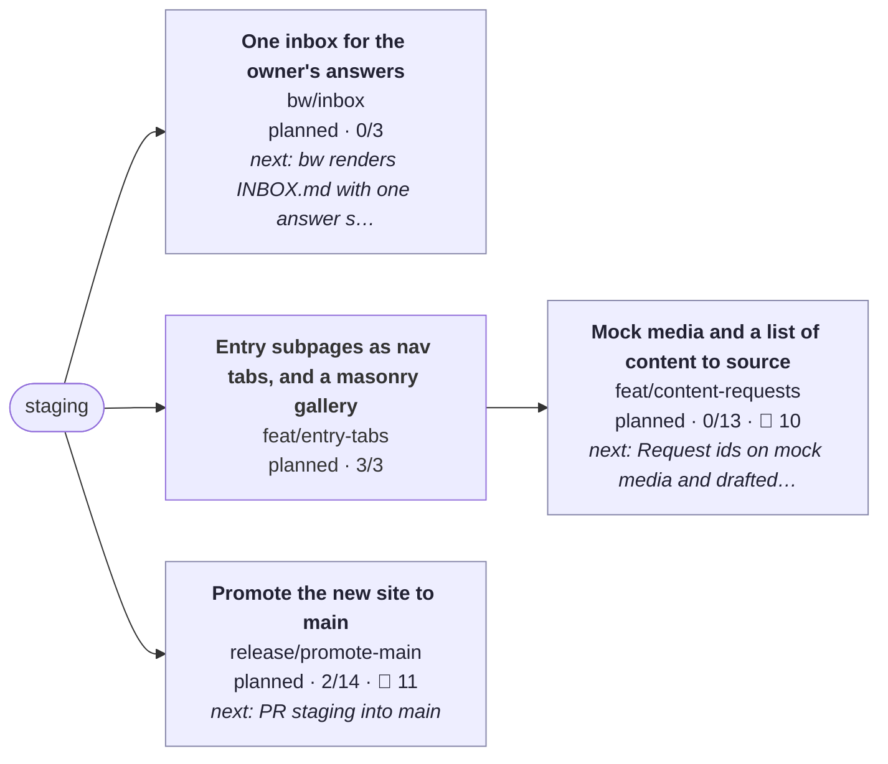

# Work board

_Updated 2026-10-04 20:07 UTC on `feat/entry-tabs` by `bw board`. Generated; edit seeds with `bw`._

🟩 active · 🟨 in review · 🟦 planned · 🟥 blocked · blue outline: checked out · 🙋 questions waiting on you

## 🙋 Needs you

**Questions**

- [ ] Approve per-entry preview images, or generate them (from feat/shareable-urls) · `feat/content-requests`
- [ ] Which page titles should link to entries? Map lines and prose mentions do now; headings are plain (from feat/global-modal) · `feat/content-requests`
- [ ] Feel check of the new open in lite and 3D (from anim/modal-open) · `release/promote-main`
- [ ] Review the Arbor and project blurbs (written from existing descriptions) (from content/real-copy) · `release/promote-main`
- [ ] Decide where /links appears (home menu, nav bar, or as home like the old branch) (from content/real-copy) · `release/promote-main`
- [ ] The resume PDF is the 2024 copy from the old site and predates Arbor (from content/real-copy) · `release/promote-main`
- [ ] Design review in 3D and lite mode (from design/retro-chrome) · `release/promote-main`
- [ ] Pick one background-primary: static CSS uses #043030, the knobs' runtime default is #003838 (read from a commented SCSS line) (from design/retro-chrome) · `release/promote-main`
- [ ] Design review on a phone (from feat/mobile-carousel) · `release/promote-main`
- [ ] Design review of the list and modal in 3D and lite mode (from feat/modal-panels) · `release/promote-main`
- [ ] Curate real panel content (screenshots, galleries, stats) per project (from feat/modal-panels) · `release/promote-main`
- [ ] Allow lossy WebP for the colour bake (q85 saves about 0.8 MB more) after a visual check (from perf/assets) · `release/promote-main`
- [ ] Approve the share image and description, and confirm the canonical domain is henryjones.xyz (from seo/meta) · `release/promote-main`

**Claims to verify** (shown on the site, marked unverified until checked)

- [ ] User notifier sends about 250,000 notifications a month (from feat/efforts) (from feat/global-modal) · `feat/content-requests`
- [ ] User notifier delivers at a 99.99% success rate (from feat/efforts) (from feat/global-modal) · `feat/content-requests`
- [ ] Almanac summary: a skill manager for the team's AI coding agents, one catalogue of shared skills kept in step across every repo (from feat/efforts) (from feat/global-modal) · `feat/content-requests`
- [ ] Kiki UI summary: the design system behind ChannelAI's iOS app (components, color, typography) (from feat/efforts) (from feat/global-modal) · `feat/content-requests`
- [ ] User notifier summary: a real-time email notification system that shows Arbor users what they are saving (from feat/efforts) (from feat/global-modal) · `feat/content-requests`

**Media to find**

- [ ] Screens or recordings of Almanac, Kiki UI and the notifier (from feat/efforts) (from feat/global-modal) · `feat/content-requests`
- [ ] An image or video for each experience entry (Arbor, ChannelAI, Mushroom, Union, Tumblr) (from feat/mobile-carousels) (from feat/links-retro) (from feat/efforts) (from feat/global-modal) · `feat/content-requests`
- [ ] Replace each 'Image to come' placeholder (5 experience entries, 3 efforts); the label says what belongs there (from feat/entry-dock) · `feat/content-requests`

## 🟢 Happening now

- **Entry subpages as nav tabs, and a masonry gallery** · `feat/entry-tabs` (checked out) · 3/3  
  next: nothing open

## 🕘 Just happened

- 1m ago · fix(modal): the title bar reads like the main nav: home, the entry's name, icon tabs · `feat/entry-tabs`
- 11m ago · fix(modal): the title bar holds the section tabs, stays pinned, and only the body scrolls · `feat/entry-tabs`
- 17m ago · feat(entries): subpages as nav tabs, a masonry gallery, and a windowed scroll · `feat/entry-tabs`

**Landed and folded**

- 2026-10-04 **feat/efforts** → `staging`: Highlighted efforts inside experience entries. Effort data model and a mini nav inside the open entry; Efforts: Almanac skill manager (Arbor), Kiki UI design system (ChannelAI), User notifier (Arbor); Hero numbers kit: big numbers plus simple theme charts for efforts without flashy visuals; Deep links from prose open the entry modal on one effort; Mark unverified data claims in the data and show it only in debug
- 2026-10-04 **feat/links-retro** → `staging`: Links page in the retro style. Restyle /links as raised retro keys, in theme with the old links page; Link to /links from About, with the old site's link icon; Axe and e2e stay green
- 2026-10-04 **feat/mobile-carousels** → `staging`: Experience and projects carousels on phones. One carousel component for experience and projects on phones; First tile centred on both axes; scroll area full width; no side dead space; Borrow the paint-in from the list entries: border draws, typewriter titles, staggered children; Keep the tile-to-page morph exactly as it is now; e2e for the experience carousel and centring
- 2026-10-04 **anim/restore-timing** → `staging`: Restore from expanded on the window's clock. Measure restore frame by frame and confirm the reflow runs ahead of the container; Copy the carousel's approach (one element owns the size change, content follows) to restore; e2e: restore keeps content inside the window and settles with it
- 2026-10-04 **fix/mobile-polish** → `staging`: Phone polish and an updated map. iOS Safari shows the page colour behind and around the page, not white (html background, theme-color); Mobile site header about 15% larger; Map: no longer on the job market; working at Arbor (remote), based in New York City; Prune the plans whose branches have all landed

<b>Plans</b>

- `2026-10-content-and-inbox.md`: 0/3 branches done
- `2026-10-mobile-efforts.md`: 7/7 branches done (complete; the next `bw land` removes it)
- `2026-10-roadmap.md`: 3/4 branches done

<b>All branches</b>

| Branch | Status | Done | Commits | Remote | Next | PR |
|---|---|---|---|---|---|---|
| `bw/inbox` | planned | 0/3 | 0 | local only | bw renders INBOX.md with one answer slot per open question |  |
| `feat/content-requests` | planned | 0/13 | 0 | local only | Request ids on mock media and drafted prose |  |
| `feat/entry-tabs` ◀ | planned | 3/3 | 3 | 9 to push, 9 to pull | — |  |
| `release/promote-main` | planned | 2/14 | 0 | pushed | PR staging into main |  |

<b>bw/inbox</b>: One inbox for the owner's answers (0/3)

Every open question and claim across branches is gathered into INBOX.md on the board branch, answerable from GitHub's editor. bw pulls answers back into the right branch's seed as a todo to act on, so the session on that workstream picks it up.

- [ ] bw renders INBOX.md with one answer slot per open question
- [ ] bw ingests answers (from origin/board) into seeds and logs them
- [ ] branchwork-loop applies the inbox at the start of a session

<b>feat/content-requests</b>: Mock media and a list of content to source (0/13)

Layouts are built against mock images and drafted prose, each tagged with a request id. A generated REQUESTS page lists everything the owner needs to source (images, links, prose, icons) with the draft beside it and where to drop the real thing; dropping a file or prose named by its id replaces the mock or draft with no code change.

- [ ] Request ids on mock media and drafted prose
- [ ] Sourced files and prose resolve by id at build time
- [ ] npm run requests renders the list; bw publishes it next to the board
- [ ] 🙋 Approve per-entry preview images, or generate them (from feat/shareable-urls)
- [ ] 🙋 Which page titles should link to entries? Map lines and prose mentions do now; headings are plain (from feat/global-modal)
- [ ] 🙋 claim: User notifier sends about 250,000 notifications a month (from feat/efforts) (from feat/global-modal)
- [ ] 🙋 claim: User notifier delivers at a 99.99% success rate (from feat/efforts) (from feat/global-modal)
- [ ] 🙋 media: Screens or recordings of Almanac, Kiki UI and the notifier (from feat/efforts) (from feat/global-modal)
- [ ] 🙋 claim: Almanac summary: a skill manager for the team's AI coding agents, one catalogue of shared skills kept in step across every repo (from feat/efforts) (from feat/global-modal)
- [ ] 🙋 claim: Kiki UI summary: the design system behind ChannelAI's iOS app (components, color, typography) (from feat/efforts) (from feat/global-modal)
- [ ] 🙋 claim: User notifier summary: a real-time email notification system that shows Arbor users what they are saving (from feat/efforts) (from feat/global-modal)
- [ ] 🙋 media: An image or video for each experience entry (Arbor, ChannelAI, Mushroom, Union, Tumblr) (from feat/mobile-carousels) (from feat/links-retro) (from feat/efforts) (from feat/global-modal)
- [ ] 🙋 media: Replace each 'Image to come' placeholder (5 experience entries, 3 efforts); the label says what belongs there (from feat/entry-dock)

<b>feat/entry-tabs</b>: Entry subpages as nav tabs, and a masonry gallery (3/3)

An open entry's subpages use the main nav's tabs (Overview is the home icon, no text), a Gallery tab appears when an entry has one, and the gallery is a two-column masonry of square, wide (2:1) and tall (1:2) cards. A check fails the build when an effort subpage has no mention in the prose.

- [x] Subpage tabs styled and built like the main nav items
- [x] Gallery subpage: masonry with square, wide and tall cards, animated reflow
- [x] check:mentions in npm run check, and a repertoire rule for it

Commits:

- `41e91db8` fix(modal): the title bar reads like the main nav: home, the entry's name, icon tabs
- `d14aab9a` fix(modal): the title bar holds the section tabs, stays pinned, and only the body scrolls
- `e4dc73fc` feat(entries): subpages as nav tabs, a masonry gallery, and a windowed scroll

<b>release/promote-main</b>: Promote the new site to main (2/14)

Retire the old webpack site once staging carries everything above.

- [x] Confirm Netlify deploy settings for main and staging
- [ ] PR staging into main
- [ ] 🙋 Feel check of the new open in lite and 3D (from anim/modal-open)
- [ ] 🙋 Review the Arbor and project blurbs (written from existing descriptions) (from content/real-copy)
- [ ] 🙋 Decide where /links appears (home menu, nav bar, or as home like the old branch) (from content/real-copy)
- [ ] 🙋 The resume PDF is the 2024 copy from the old site and predates Arbor (from content/real-copy)
- [ ] 🙋 Design review in 3D and lite mode (from design/retro-chrome)
- [ ] 🙋 Pick one background-primary: static CSS uses #043030, the knobs' runtime default is #003838 (read from a commented SCSS line) (from design/retro-chrome)
- [ ] 🙋 Design review on a phone (from feat/mobile-carousel)
- [ ] 🙋 Design review of the list and modal in 3D and lite mode (from feat/modal-panels)
- [ ] 🙋 Curate real panel content (screenshots, galleries, stats) per project (from feat/modal-panels)
- [x] Confirm the first CI run is green on every stacked PR (from modalize-leva-work)
- [ ] 🙋 Allow lossy WebP for the colour bake (q85 saves about 0.8 MB more) after a visual check (from perf/assets)
- [ ] 🙋 Approve the share image and description, and confirm the canonical domain is henryjones.xyz (from seo/meta)

