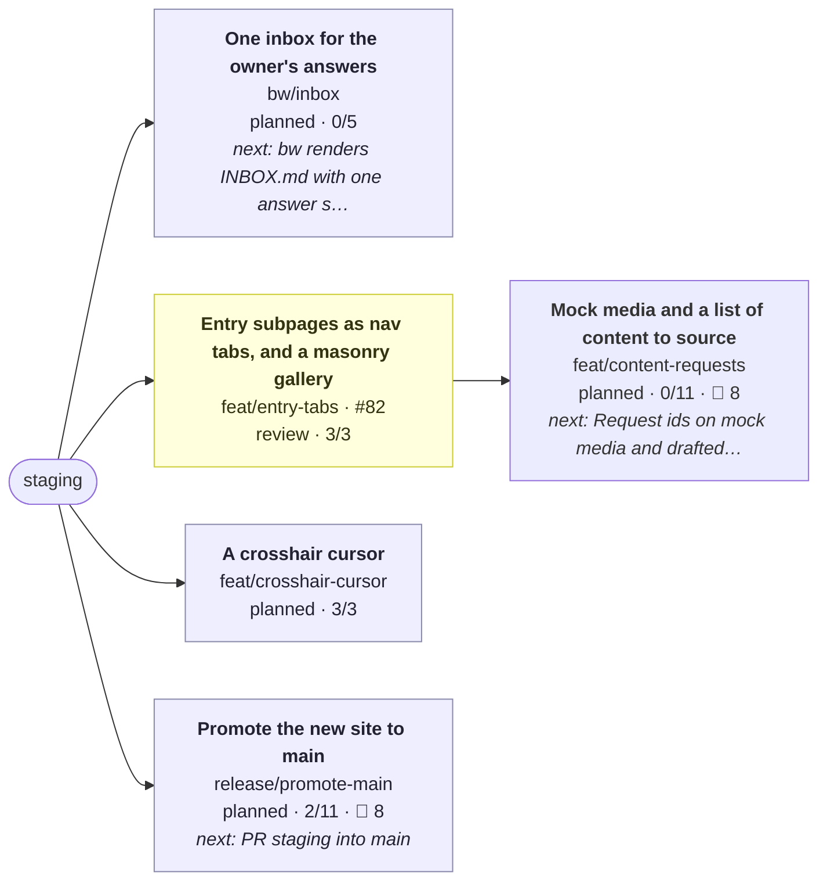

# Work board

<b>About this board</b> · updated 2026-10-04 20:19 UTC · 5 live branches · 1 PRs open · 17 waiting on you

| | |
|---|---|
| Generated | 2026-10-04 20:19 UTC by `bw board` on `feat/content-requests` |
| Trunk | `staging` |
| Live branches | 5 |
| Open PRs | [#82](https://github.com/henryjonescodes/portfolio/pull/82) |
| Waiting on you | 17 |
| Source of truth | each branch's seed in `.work/branches/`; this file is regenerated, never edited |

<b>Legend</b>

- 🟩 active: being worked on now
- 🟨 review: a PR is open and waiting on CI, review or a merge
- 🟦 planned: sketched as a branch with a seed, not started
- 🟥 blocked: waiting on something outside the branch
- Blue outline: the branch checked out in the working copy
- `3/4`: todos done out of total · 🙋 n: questions on that branch waiting on you
- Arrows point from a branch to the branches built on top of it

## 🟢 Happening now

**What.** Layouts are built against mock images and drafted prose, each tagged with a request id. A generated REQUESTS page lists everything the owner needs to source (images, links, prose, icons) with the draft beside it and where to drop the real thing; dropping a file or prose named by its id replaces the mock or draft with no code change.

**How, next.**

- Request ids on mock media and drafted prose
- Sourced files and prose resolve by id at build time
- npm run requests renders the list; bw publishes it next to the board

| Branch | PR | Status | Progress | Next | Plan |
|---|---|---|---|---|---|
| `feat/content-requests` |  | planned, local only | 0/11 | Request ids on mock media and drafted prose |  |

## 🕘 Just happened

**feat(cursor): a crosshair pointer with dashed guides behind the content** · 2026-10-04 20:18 · `feat/crosshair-cursor` · `21cece7c`
On mouse and trackpad the system cursor becomes a small crosshair that inverts against what is under it and opens up over anything clickable. Dashed guides run from the pointer to every edge, layered over the background and under the content and nav. Touch screens keep their own behaviour.

- **fix(modal): the close button sits inside the title bar, with the frame as its edge** · 20:13 · [#82](https://github.com/henryjonescodes/portfolio/pull/82) · `e0c96483`
- **fix(modal): the title bar reads like the main nav: home, the entry's name, icon tabs** · 20:06 · [#82](https://github.com/henryjonescodes/portfolio/pull/82) · `be7fc0f6`
- **fix(modal): the title bar holds the section tabs, stays pinned, and only the body scrolls** · 20:06 · [#82](https://github.com/henryjonescodes/portfolio/pull/82) · `d6eb511a`

<b>Earlier</b> (full notes for every landed branch are in the <a href="https://github.com/henryjonescodes/portfolio/blob/staging/.work/CHANGELOG.md">changelog</a>)

| When | What | Where |
|---|---|---|
| 2026-10-04 19:35 | feat(entries): an effort dock and labelled placeholder media | [#81](https://github.com/henryjonescodes/portfolio/pull/81) · `a099d865` |
| 2026-10-04 19:18 | test: modal close asserts the outcome, not a mid-close style the faster close skips | [#80](https://github.com/henryjonescodes/portfolio/pull/80) · `db04bcdf` |
| 2026-10-04 19:15 | fix(modal): a window with nothing to land on shrinks and fades about the middle | [#80](https://github.com/henryjonescodes/portfolio/pull/80) · `05b63c49` |
| 2026-10-04 19:12 | feat(modal): the desktop modal opens like the phone carousel; links zoom out of their word | [#80](https://github.com/henryjonescodes/portfolio/pull/80) · `63c1f59e` |
| 2026-10-04 19:12 | docs: roadmap reflects efforts, sharing and entry links | [#80](https://github.com/henryjonescodes/portfolio/pull/80) · `f2d37efd` |
| 2026-10-04 19:11 | feat(modal): any link can open an entry, zooming out of where it was clicked | [#80](https://github.com/henryjonescodes/portfolio/pull/80) · `21bfc4b4` |
| 2026-10-04 19:11 | fix(share): restore a shared link from the address bar, not the router's stale query | [#80](https://github.com/henryjonescodes/portfolio/pull/80) · `e18c2be4` |
| 2026-10-04 13:45 | fix(share): no closed-modal flash on arrival, page titles, no router render mid-morph | [#80](https://github.com/henryjonescodes/portfolio/pull/80) · `646fcd90` |
| 2026-10-04 13:45 | fix(a11y): nav items are keyboard-reachable links | [#80](https://github.com/henryjonescodes/portfolio/pull/80) · `fa77adbf` |

## 🙋 Questions for you

### Facts to confirm

**1. User notifier sends about 250,000 notifications a month**
- *Why:* The User notifier effort leads with this figure, shown as unverified on the live site until you confirm it.
- `claim` · `feat/content-requests` · from `feat/efforts` · [experience.ts](https://github.com/henryjonescodes/portfolio/blob/staging/src/data/experience.ts)

**2. User notifier delivers at a 99.99% success rate**
- *Why:* The second headline figure on the User notifier effort, also marked unverified until confirmed.
- `claim` · `feat/content-requests` · from `feat/efforts` · [experience.ts](https://github.com/henryjonescodes/portfolio/blob/staging/src/data/experience.ts)

### Writing

**3. Almanac summary: a skill manager for the team's AI coding agents, one catalogue of shared skills kept in step across every repo**
- *Why:* Drafted from the existing entry text; you want most prose human-written and lightly edited.
- `prose` · `feat/content-requests` · from `feat/efforts` · [experience.ts](https://github.com/henryjonescodes/portfolio/blob/staging/src/data/experience.ts)

**4. Kiki UI summary: the design system behind ChannelAI's iOS app (components, color, typography)**
- *Why:* Drafted from the existing entry text; you want most prose human-written and lightly edited.
- `prose` · `feat/content-requests` · from `feat/efforts` · [experience.ts](https://github.com/henryjonescodes/portfolio/blob/staging/src/data/experience.ts)

**5. User notifier summary: a real-time email notification system that shows Arbor users what they are saving**
- *Why:* Drafted from the existing entry text; you want most prose human-written and lightly edited.
- `prose` · `feat/content-requests` · from `feat/efforts` · [experience.ts](https://github.com/henryjonescodes/portfolio/blob/staging/src/data/experience.ts)

**6. Review the Arbor and project blurbs (written from existing descriptions)**
- *Why:* They were rewritten from older descriptions and are the first thing visitors read in each entry.
- `prose` · `release/promote-main` · from `content/real-copy` · [experience.ts](https://github.com/henryjonescodes/portfolio/blob/staging/src/data/experience.ts)

### Decisions

**7. Approve per-entry preview images, or generate them**
- *Why:* Shared links show a per-page title and description, but one site-wide image for every entry.
- `decision` · `feat/content-requests` · from `feat/shareable-urls` · [og-image.png](https://github.com/henryjonescodes/portfolio/blob/staging/public/og-image.png)

**8. Which page titles should link to entries? Map lines and prose mentions do now; headings are plain**
- *Why:* Map lines and prose mentions open entries anywhere on the site; headings are still plain text.
- `decision` · `feat/content-requests` · from `feat/global-modal` · [index.tsx](https://github.com/henryjonescodes/portfolio/blob/staging/src/components/EntryLink/index.tsx)

**9. Decide where /links appears (home menu, nav bar, or as home like the old branch)**
- *Why:* The page exists and About links to it, but nothing else on the site leads there.
- `decision` · `release/promote-main` · from `content/real-copy` · [index.tsx](https://github.com/henryjonescodes/portfolio/blob/staging/src/pages/links/index.tsx)

**10. Pick one background-primary: static CSS uses #043030, the knobs' runtime default is #003838 (read from a commented SCSS line)**
- *Why:* The colour shifts slightly when a knob first moves, because static CSS and the knobs start from different shades.
- `decision` · `release/promote-main` · from `design/retro-chrome` · [_colors.scss](https://github.com/henryjonescodes/portfolio/blob/staging/src/styles/_colors.scss#L12)

**11. Allow lossy WebP for the colour bake (q85 saves about 0.8 MB more) after a visual check**
- *Why:* The 3D colour texture could be about 0.8 MB smaller, but only if it still looks right to you.
- `decision` · `release/promote-main` · from `perf/assets` · [images](https://github.com/henryjonescodes/portfolio/blob/staging/public/3D/images)

**12. Approve the share image and description, and confirm the canonical domain is henryjones.xyz**
- *Why:* Every shared link shows this card; it also settles which domain is canonical.
- `decision` · `release/promote-main` · from `seo/meta` · [og-image.png](https://github.com/henryjonescodes/portfolio/blob/staging/public/og-image.png)

### Files to send

**13. Replace each 'Image to come' placeholder (5 experience entries, 3 efforts); the label says what belongs there**
- *Why:* Every entry, effort and gallery shows a labelled stand-in until a real image or video arrives.
- `media` · `feat/content-requests` · from `feat/entry-dock` · [experience.ts](https://github.com/henryjonescodes/portfolio/blob/staging/src/data/experience.ts)

**14. The resume PDF is the 2024 copy from the old site and predates Arbor**
- *Why:* The linked resume predates Arbor; send a new PDF or keep the old one for now.
- `media` · `release/promote-main` · from `content/real-copy` · [Henry-Jones-Resume.pdf](https://github.com/henryjonescodes/portfolio/blob/staging/public/pdf/Henry-Jones-Resume.pdf)

**15. Curate real panel content (screenshots, galleries, stats) per project**
- *Why:* Project modals show panels built from existing copy only; screenshots, galleries and stats make them worth opening.
- `media` · `release/promote-main` · from `feat/modal-panels` · [projects.ts](https://github.com/henryjonescodes/portfolio/blob/staging/src/data/projects.ts)

### Reviews

**16. Design review in 3D and lite mode**
- *Why:* main still serves the old site, and you promote by hand once staging looks right: walk 3D, lite and a phone, including the list and modal, retro chrome, the carousel, tabs and gallery.
- `review` · `release/promote-main` · from `design/retro-chrome`

**17. Review and merge Entry subpages as nav tabs, and a masonry gallery**
- *Why:* its PR is open and waiting on a merge
- `review` · `feat/entry-tabs` · [#82](https://github.com/henryjonescodes/portfolio/pull/82)

<b>Plans</b>

| Plan | Progress |
|---|---|
| [2026-10-roadmap.md](https://github.com/henryjonescodes/portfolio/blob/staging/.work/plans/2026-10-roadmap.md) | 3 of 4 branches done |

<b>All branches</b>

| Branch | Title | Status | PR | Todos | Commits | Remote | Next |
|---|---|---|---|---|---|---|---|
| `bw/inbox` | One inbox for the owner's answers | planned |  | 0/5 | 0 | local only | bw renders INBOX.md with one answer slot per open question |
| `feat/content-requests` ◀ | Mock media and a list of content to source | planned |  | 0/11 | 0 | local only | Request ids on mock media and drafted prose |
| `feat/crosshair-cursor` | A crosshair cursor | planned |  | 3/3 | 1 | pushed |  |
| `feat/entry-tabs` | Entry subpages as nav tabs, and a masonry gallery | review | [#82](https://github.com/henryjonescodes/portfolio/pull/82) | 3/3 | 4 | pushed |  |
| `release/promote-main` | Promote the new site to main | planned |  | 2/11 | 0 | 18 to push | PR staging into main |

<code>bw/inbox</code>: One inbox for the owner's answers (0/5)

Every open question and claim across branches is gathered into INBOX.md on the board branch, answerable from GitHub's editor. bw pulls answers back into the right branch's seed as a todo to act on, so the session on that workstream picks it up.

- [ ] bw renders INBOX.md with one answer slot per open question
- [ ] bw ingests answers (from origin/board) into seeds and logs them
- [ ] branchwork-loop applies the inbox at the start of a session
- [ ] bw stats: a STATS.md beside the board with lines added and removed, commits, PRs and files changed since a base, plus a before and after file tree (files on unmerged branches marked 🚧, sketched branches listed as planned)
- [ ] Board layout from the approved sample: metadata and legend folded, Happening now with motivation, what, how and a table, Just happened (one full, three short, earlier folded with changelog links), questions grouped by kind with why, ask and file links, instructions folded

<code>feat/content-requests</code>: Mock media and a list of content to source (0/11)

Layouts are built against mock images and drafted prose, each tagged with a request id. A generated REQUESTS page lists everything the owner needs to source (images, links, prose, icons) with the draft beside it and where to drop the real thing; dropping a file or prose named by its id replaces the mock or draft with no code change.

- [ ] Request ids on mock media and drafted prose
- [ ] Sourced files and prose resolve by id at build time
- [ ] npm run requests renders the list; bw publishes it next to the board
- [ ] 🙋 Approve per-entry preview images, or generate them (from feat/shareable-urls)
- [ ] 🙋 Which page titles should link to entries? Map lines and prose mentions do now; headings are plain (from feat/global-modal)
- [ ] 🙋 claim: User notifier sends about 250,000 notifications a month (from feat/efforts) (from feat/global-modal)
- [ ] 🙋 claim: User notifier delivers at a 99.99% success rate (from feat/efforts) (from feat/global-modal)
- [ ] 🙋 claim: Almanac summary: a skill manager for the team's AI coding agents, one catalogue of shared skills kept in step across every repo (from feat/efforts) (from feat/global-modal)
- [ ] 🙋 claim: Kiki UI summary: the design system behind ChannelAI's iOS app (components, color, typography) (from feat/efforts) (from feat/global-modal)
- [ ] 🙋 claim: User notifier summary: a real-time email notification system that shows Arbor users what they are saving (from feat/efforts) (from feat/global-modal)
- [ ] 🙋 media: Replace each 'Image to come' placeholder (5 experience entries, 3 efforts); the label says what belongs there (from feat/entry-dock)

<code>feat/crosshair-cursor</code>: A crosshair cursor (3/3)

The pointer becomes a small crosshair, with dashed guide lines running to every edge of the screen. The lines sit behind the page content and in front of the background; the small mark rides on top with a blend mode so it reads against anything.

- [x] Guide lines follow the pointer behind the content, in front of the background
- [x] Small crosshair on top with a difference blend; grows over anything clickable
- [x] Fine pointers only; touch and reduced motion keep the plain cursor where it matters

<code>feat/entry-tabs</code>: Entry subpages as nav tabs, and a masonry gallery (3/3)

An open entry's subpages use the main nav's tabs (Overview is the home icon, no text), a Gallery tab appears when an entry has one, and the gallery is a two-column masonry of square, wide (2:1) and tall (1:2) cards. A check fails the build when an effort subpage has no mention in the prose.

- [x] Subpage tabs styled and built like the main nav items
- [x] Gallery subpage: masonry with square, wide and tall cards, animated reflow
- [x] check:mentions in npm run check, and a repertoire rule for it

<code>release/promote-main</code>: Promote the new site to main (2/11)

Retire the old webpack site once staging carries everything above.

- [x] Confirm Netlify deploy settings for main and staging
- [ ] PR staging into main
- [ ] 🙋 Review the Arbor and project blurbs (written from existing descriptions) (from content/real-copy)
- [ ] 🙋 Decide where /links appears (home menu, nav bar, or as home like the old branch) (from content/real-copy)
- [ ] 🙋 The resume PDF is the 2024 copy from the old site and predates Arbor (from content/real-copy)
- [ ] 🙋 Design review in 3D and lite mode (from design/retro-chrome)
- [ ] 🙋 Pick one background-primary: static CSS uses #043030, the knobs' runtime default is #003838 (read from a commented SCSS line) (from design/retro-chrome)
- [ ] 🙋 Curate real panel content (screenshots, galleries, stats) per project (from feat/modal-panels)
- [x] Confirm the first CI run is green on every stacked PR (from modalize-leva-work)
- [ ] 🙋 Allow lossy WebP for the colour bake (q85 saves about 0.8 MB more) after a visual check (from perf/assets)
- [ ] 🙋 Approve the share image and description, and confirm the canonical domain is henryjones.xyz (from seo/meta)

<b>How to use this board</b>

- **Start at Happening now.** It says why the current work matters, what is being built, how, and where to look. The diagram above it maps everything in flight.
- **Just happened** is newest first: one full entry, three short ones, the rest folded with links to the changelog, which keeps the full notes for every landed branch.
- **Questions are grouped** by what they need from you: a fact, some writing, a decision, a file, a check or a review. Each says why it is asked and links the file it is about, so you can decide without opening a session.
- **Answering:** reply in chat for now; a single INBOX.md you can answer on GitHub is on the way.
- **This file is generated** on every commit from the branches' seeds, so edits here are overwritten. To change what is tracked, ask in chat or edit a seed with `bw`.

